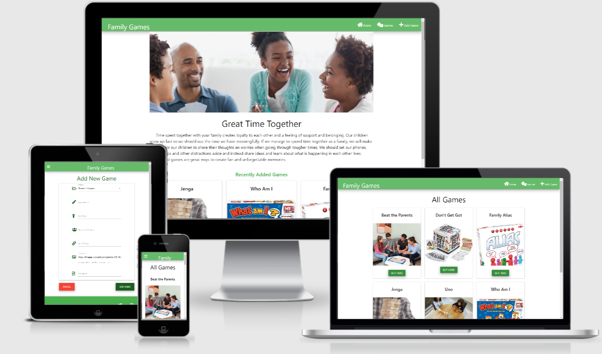
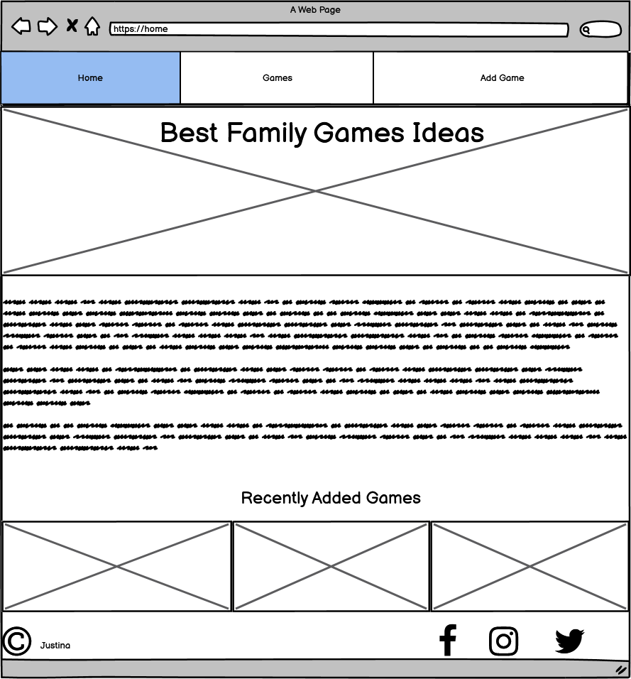
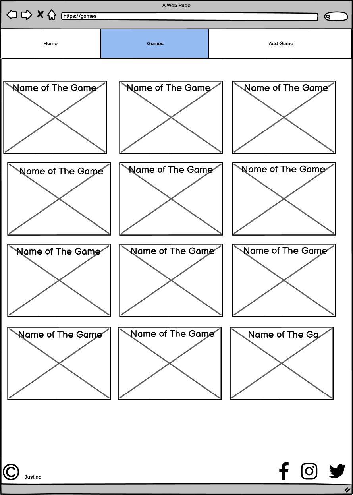
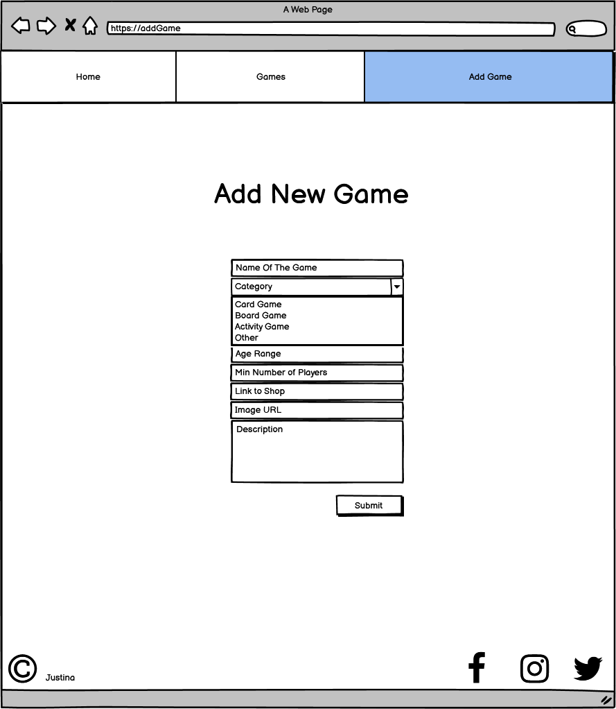
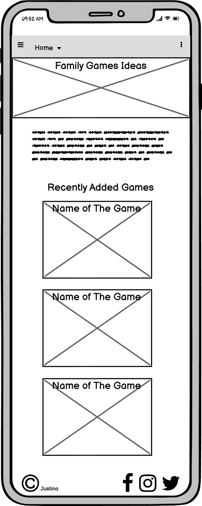
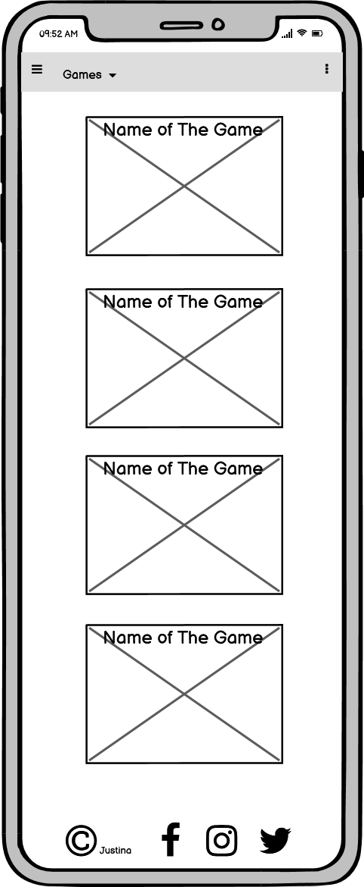
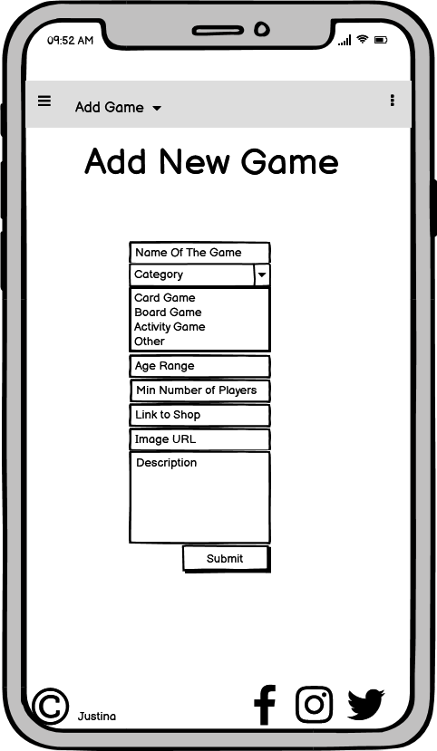

# Family Games

### [View the live project here.](https://family-games.herokuapp.com/)




For my Data Centric Development Milestone Project I have created Family Games Heroku application. Application is designed for families who are tired of routine and need entertainment for long winter evenings without going out of their home.
 
## UX
 
This application focus on families with children. Chose light colours for nice visual look. Each game is placed in individual card.

 ### User Stories

- As a user, I want easy navigation, so that I can easily find what I need.
- As a user, I want to find infomation about games and explanation how to play.
- As a user, I want to find information where to buy game that I like.
- As a user, I want to share games I like with other users.
- As a user, I want opportunity to edit any game if I find a mistake.
- As a user, I want to have my own account, where I can save those games that I like as a collection.
- As a user, I want to use a search bar before inserting new game to prevent repeating.
- As a user, I want to delete the game if I think it is inappropriate.
- As a user, I want to add a game that I'm currently selling to attract more buyers


### Wireframes
I used Balsamiq wireframes to design my project.








## Features
 
### Existing Features

#### Home
- Has eye catching carousel type photo galery.
- Inspiring introduction.
- Shows 3 most recent games.

#### Games
- In this part you can find all added games in alphabetical order.
- Each game is placed inside card.
- On the front of the card user can see name of the game, game image and Buy Here button which leads straight to the shop where user can buy the game he/she likes.
- User can click on the card to see more information: _Game Category_, _Age Range_, _Number of Players_ and game _Description_. Also 2 buttons at the bottom: _Edit_ and _Delete_.

 #### Add/Edit/Delete Game
- In this part user can fill the form with game details.
- Form has _Choose Category_, _Game Name_, _Age Range_, _Number Of Players_, _Link To Shop_, _Image URl_(which is prefilled with default URL) and _Description_.
- User can press _Add Game_ button to submit his form or press _Cancel_ button if changed his/her mind.
- _Edit Game_ form is simular to _Add New Game_ form, but is prefilled with old game information which user can update.
- _Delete_ button will delete game from app and Mongo DB and redirects user to _Games_ page.


### Features Left to Implement
- Create Sign Up, Log In and Log Out features.
- Create user profile page where user can save and view chosen games.
- Create Search bar.
- Make _Link To Shop_ field optional, and remove _Buy Here_ button if that field is empty or link isn't correct.
- Format images.
- Add more defencing programming, e.g. to prevent accidental deletions.

## Technologies Used

For app development I used these technologies:

- [JQuery](https://jquery.com) - to simplify DOM manipulation.
- [JavaScript](https://www.javascript.com/) - to make application interactive.
- [HTML5](https://en.wikipedia.org/wiki/HTML#:~:text=Hypertext%20Markup%20Language%20(HTML)%20is,scripting%20languages%20such%20as%20JavaScript.) - to create and structure content of the app.
- [CSS](https://en.wikipedia.org/wiki/CSS) - to style application.
- [Python](https://www.python.org/) - to create the back-end function of the app.
- [Flask](https://en.wikipedia.org/wiki/Flask_(web_framework)) - microframework for easier python app coding.
- [Jinja](https://jinja.palletsprojects.com/en/2.11.x/) - templating language for Python to make code more readable.
- [PyMongo](https://pymongo.readthedocs.io/en/stable/) -  is a Python distribution containing tools for working with MongoDB, and is the recommended way to work with MongoDB from Python.
- [MongoDB](https://www.mongodb.com/) - used MongoDB Atlas to store all games data.
- [GitPod](https://www.gitpod.io/) - to write code for my project.
- [Git Version Control](https://git-scm.com/book/en/v2/Getting-Started-About-Version-Control) - to record changes made to my code.
- [GitHub](https://github.com/) - remote repository to commit and to push to staged changes.
- [Heroku](https://signup.heroku.com/?c=70130000000NeLCAA0&gclid=EAIaIQobChMIzKT4iOHQ7QIVL4BQBh1gdwwyEAAYASAAEgIdYPD_BwE) - used Heroku to deploy my project.
- [Materialize](https://materializecss.com/) - framework used for faster development.
- Font Awsome icons

## Testing

 __[Testing Write Up](testing.md)__

## Deployment

I used Heroku for deployment. To deploy app to Heroku I used these steps:
- Create Flask app on GitPod.
- Tell Heroku which applications and dependancies are required to run the app ```pip3 freeze --local > requirements.txt```
- Tell Heroku which file run the app ```echo web: python app.py > Procfile```
- Go to Heroku.com and log in.
- On Heroku dashboard(right corner) click "Create a New App".
- App name is "family-games" all in lower cases.
- Choose closest region (Europe).
- Click "Create App".
- Choose deployment method "GitHub".
- Insert GitHub repository name and click "Search".
- Once GitHub repository is found click "Connect".
- Click on "Settings" button and then "Reveal Config Vars".
- Add these config keys(and values): 
    * IP 
    * PORT 
    * SECRET_KEY
    * MONGO_URI
    * MONGO_DBNAME
- Go to GitPod and in terminal window:
    * Add requirements.txt
    * Commit changes
    * Add Procfile
    * Commit changes
    * Push changes to GitHub
- Go back to Heroku
- On deploy section click "Enable Automatic Deploy" then "Deploy Branch"

## Credits

### Content
- All JavaScript code wasn't written by me. Some coppied from Meterialize for better forms, carousel and navbar functionality. Other part, coppied from Code Institute lessons, improves select options functionality.
- All Python code written by me
- This app is created using Materialize framework for design and responsiveness

### Media
- The photos used in this site were obtained from:
[unsplash.com](https://images.unsplash.com)
[Sign up genius](https://www.signupgenius.com/cms/socialMediaImages/family-night-game-ideas-facebook-1200x630.png)
[siparent](https://www.siparent.com/wp-content/uploads/2020/04/family-game-night.jpg)
[dtcn](https://img.dtcn.com/image/21oak/family-board-games-featured-resized-1200x630-c-ar1.91-n.jpg)
[the market](https://themarket.com/nz/discover/wp-content/uploads/2019/09/Monopoly-Game-Kids-1-1600x912.jpg)

- The image URLs for cards depends on users input(most of existing images were taken from [Amazon](https://www.amazon.co.uk/?&tag=hydraamazonav-21&ref=pd_sl_781ozcfkw8_e&adgrpid=52740778523&hvpone=&hvptwo=&hvadid=259053350854&hvpos=&hvnetw=g&hvrand=11621843773297804471&hvqmt=e&hvdev=c&hvdvcmdl=&hvlocint=&hvlocphy=1006984&hvtargid=kwd-10573980&hydadcr=13724_1720403&gclid=EAIaIQobChMI7oiv9t7Q7QIVBuvtCh2BeQ-yEAAYASAAEgKhIfD_BwE))
- Cards content coppied from [Amazon](https://www.amazon.co.uk/?&tag=hydraamazonav-21&ref=pd_sl_781ozcfkw8_e&adgrpid=52740778523&hvpone=&hvptwo=&hvadid=259053350854&hvpos=&hvnetw=g&hvrand=11621843773297804471&hvqmt=e&hvdev=c&hvdvcmdl=&hvlocint=&hvlocphy=1006984&hvtargid=kwd-10573980&hydadcr=13724_1720403&gclid=EAIaIQobChMI7oiv9t7Q7QIVBuvtCh2BeQ-yEAAYASAAEgKhIfD_BwE)


### Acknowledgements
This site is created for learning purposes
Want to say thank you for:
- Code Institute - for well prepared lessons.
- My mentor - for great advises during project development.
- Slack community - found a lot of information there.
