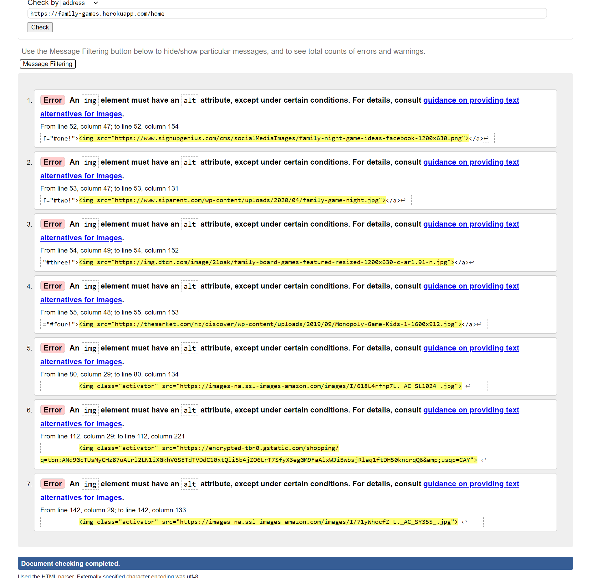
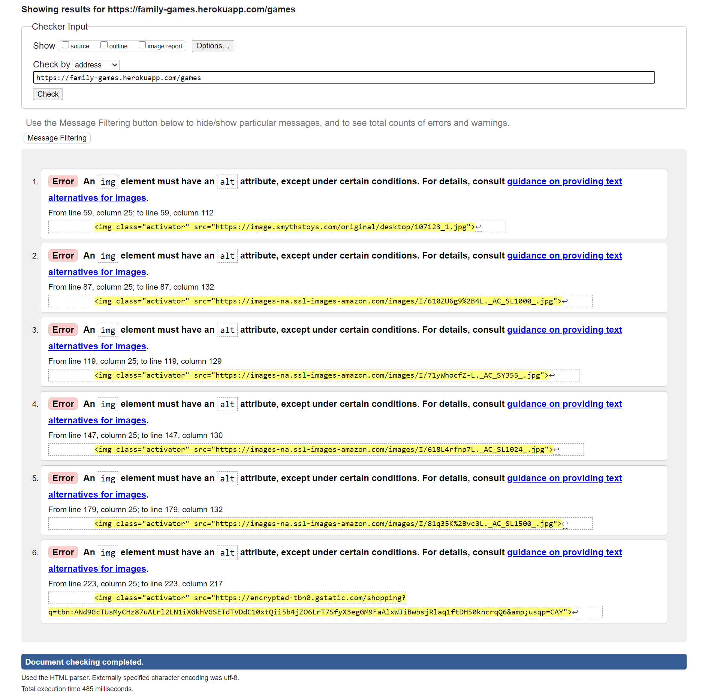
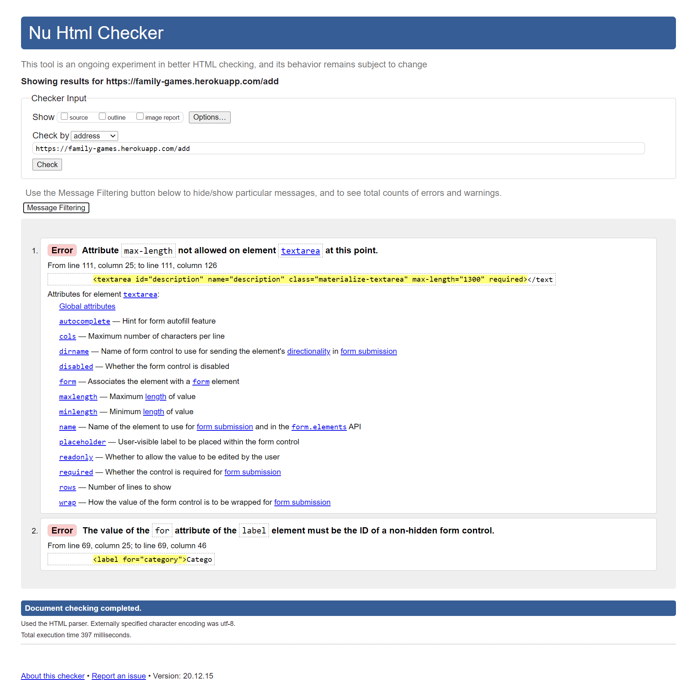
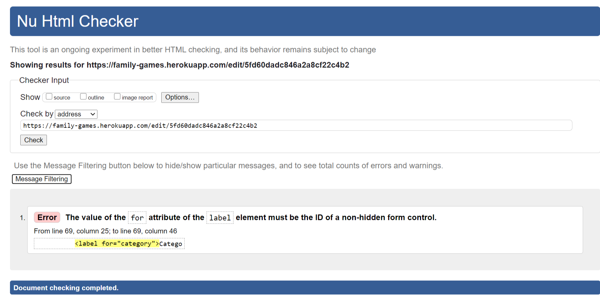
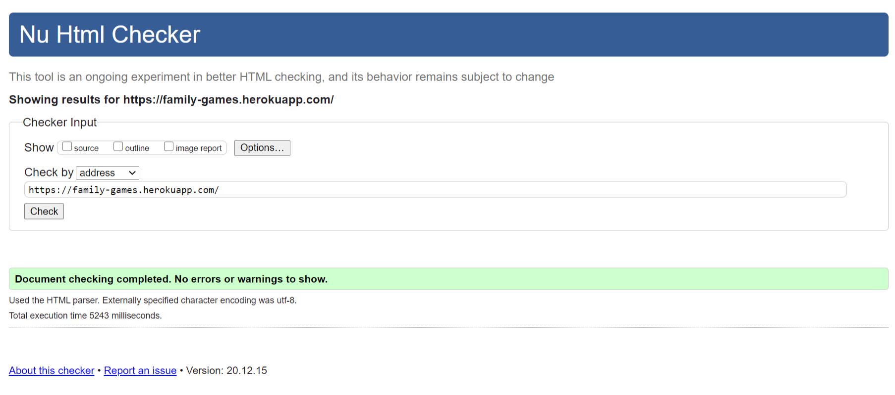
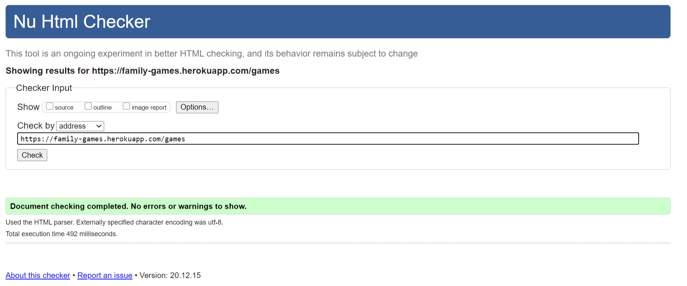
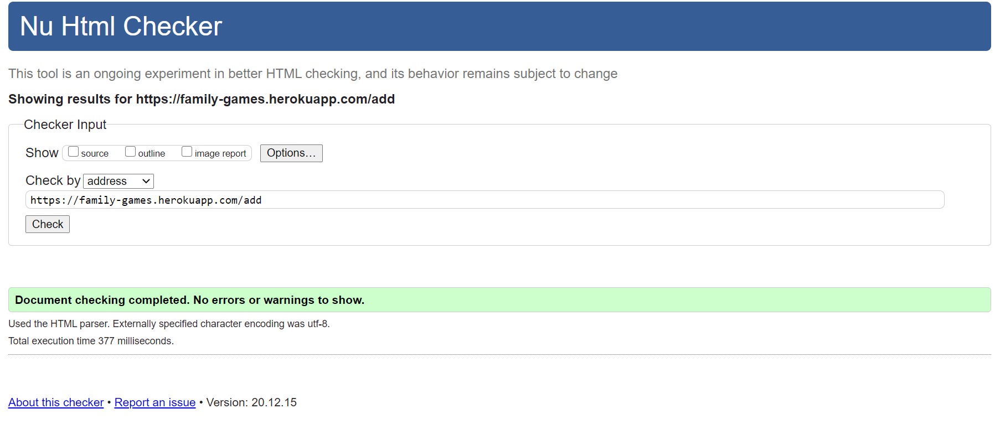
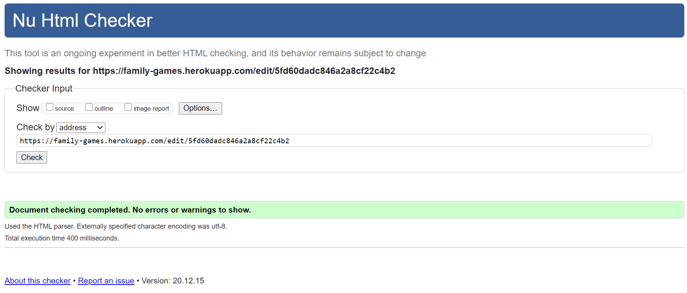
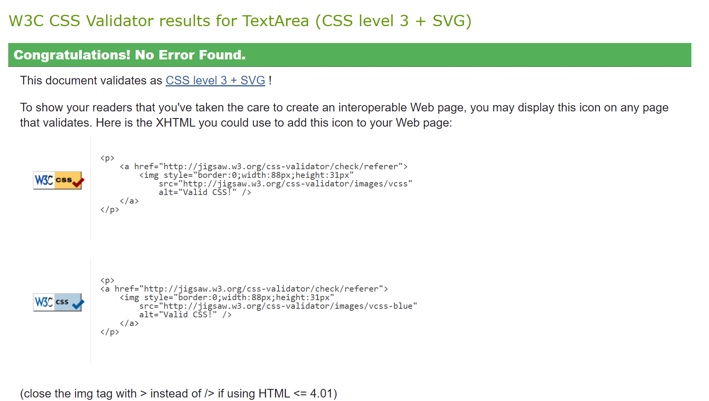
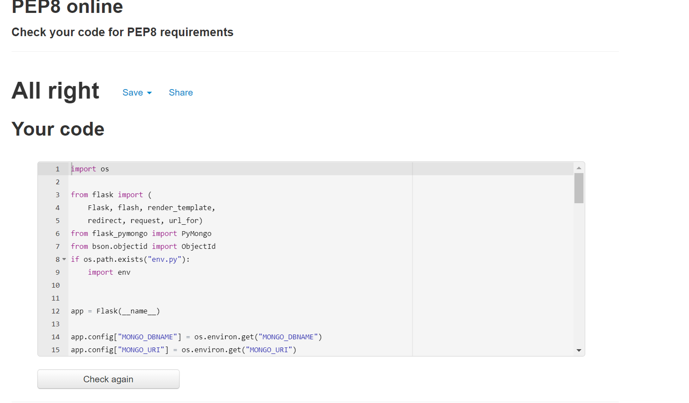

# Testing
[Back to README.md](README.md)

The following tests have been made by developer

## Manual Testing
- Application have been tested using _Opera_, _Chrome_, _Firefox_ browsers. No issues found.
- Tested using DevTools on browsers mentioned above, works fine on all screens.
- Tested with Huawei P10 and Samsung Tab no issues found but image loading speed needs to be improved.

## Automated Testing
### HTML
HTML code tested using [W3C HTML Validator](https://validator.w3.org/)

#### Issues Found:
- No _alt_ atrribute on all _img_ elements

- _max-length_ atrribute not allowed on _textarea_ element.
- Element's _id_ and atrribute _for_ mismatch in Add New Game and Edit Game forms.

#### Issues Fixed:
- All issues fixed. Passed [W3C HTML Validator](https://validator.w3.org/)

### CSS
CSS code tested using [W3C CSS Validator](https://jigsaw.w3.org/css-validator/) and no issues found.
- CSS code passed [W3C CSS Validator](https://jigsaw.w3.org/css-validator/)

### Python 
Python code meets all PEP8 requirements

### JavaScript
JavaScript code were tested using [JS Hint](https://jshint.com/)
- No issues found.

[Back to README.md](README.md)